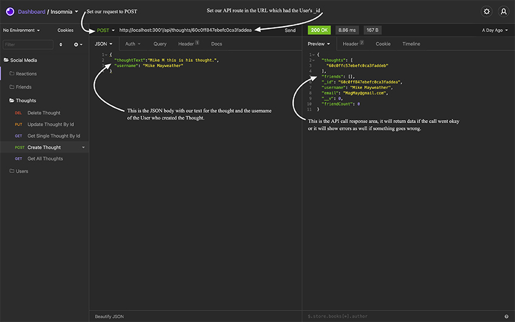

<h1 id="socialNetwork">🎉 Social Network API 🎉</h1>


<p>A server-side application where users can share their thoughts, react to each others thoughts, and add other users to a friends list.</p>


<h2>Table of Contents 📚<h2>

* [Installation](#installation)
* [Testing](#testing)
* [User Routes](#userRoutes)
* [Friend Routes](#friendRoutes)
* [Thought Routes](#thoughtRoutes)
* [Reaction Routes](#reactionRoutes)
* [Video Walkthrough](#videoDemonstration)
* [Built With](#built)
* [Future Updates](#future)
* [Author](#author)
* [Contributions](#contribute)
* [Give Support](#Support)


<h2 id="installation">Installation 👨‍🏭</h2>


<p>In order to install this application simply clone the repository from GitHub to your local computer. For more information on how to properly clone a repository you can visit the <a href="https://docs.github.com/en/github/creating-cloning-and-archiving-repositories/cloning-a-repository-from-github/cloning-a-repository">GitHub Docs: Cloning a repository page</a>. You will also need to install MongoDB, as the application uses MongoDB NoSQL database. You can install a <a href="https://docs.mongodb.com/manual/administration/install-community/">free community edition</a>.  Once you have cloned the repository, and completed the installation of MongoDB, you need to install Node Package Manager or "npm" within the root directory of the project. This can be done by opening the terminal of your choice (I am a Mac user and prefer iTerm), navigating to the local root folder of this repository and entering:<p>

```sh
npm install
```

<p>For a more in depth understanding of the application, you could learn the basics of <a href="https://apifriends.com/api-management/whats-api-call/">API (Application Programming Interface)</a> calls (article by <a href="https://apifriends.com/author/csiegel/">Camille Siegel</a>), NoSQL databases like MongoDB, and a limited understanding of both <a href="https://expressjs.com/">Express.js</a> and <a href="https://mongoosejs.com/">Mongoose.js</a>. These amazing technologies are well worth further investigation. You can still experience the application by following along with this README.md, or watching the full-walkthrough video at the bottom of the page. Now, back to the installation.</p>


<p>I personally used VSCode as my code editor and prefer to open my terminal in the IDE or "Integrated Development Environment" of VSCode. Entering "npm install" in the command line interface will install all the dependencies you need to run the application with node.js. For futher information on "npm" visit the <a href="https://www.npmjs.com/">npm hompage</a>. Now that you have everything installed locally, you can test the api features of the application.</p>


<h2 id="testing">Testing 👩‍🔬</h2> 


<p>Since <strong>Social Network API</strong> is a server-side application, there is no webpage to see code implementation. You could use the same code framework supplied and then create a front-end framework. This front end could interact with (and display) the MongoDB data returned from the API calls, a future upgrade if you so desired. In the applications current state, the best way to see the functionality is to use an API endpoint testing tool. For the video and creation of this project I used Insomnia which you can download and discover more about at their <a href="https://support.insomnia.rest/article/157-getting-started-with-insomnia">homepage</a>. Another popular option is Postman which you can download and learn more about here at their <a href="https://www.postman.com/">homepage</a>. There is not much of a difference when it comes to testing this specific application, but each will have their pros and cons in certain scenarios. For a more in depth comparison <a href="https://www.paigeniedringhaus.com/">Paige Niedringhaus</a>
writes and excellent article about them on <a href="https://itnext.io/postman-vs-insomnia-comparing-the-api-testing-tools-4f12099275c1">Medium</a>. Once you have chosen your endpoint testing tool, we need to start the server so that the api routes can access the database and return information to the testing tool. To do so, enter the root directory of your local project in your CLI (command line interface) shell, and type:</p>

```sh
npm start
```

<p>That has started your local server with MongoDB and populated your database with the models and schema necessary to begin API testing. If you open Insomnia, you can test the functions of the application by following these steps:</p>


<h3>Testing API Routes 🌏</h3>


<h4 id="userRoutes"><strong>User Routes 🧗</strong></h4>


<p>If you wish to create a new `User` and add them to the database, you need to give Insomnia an api route in the URL bar provided, and select <strong>POST</strong> as the request. Create a JSON body with a <em>username</em> and an <em>email</em> for the user. Please refer to the following image, or the walkthrough video for demonstration. <em>The '<' '>' will not be in any of the URLs or JSON bodies, any placement of the "greater than" or "less than" symbols (or content text within) are there strictly for the purpose of demonstrative placeholders to describe what information should be placed there.</em></p>


```sh
URL: http://localhost:3001/api/users

JSON body:
{
	"username":"<username-choice-here>",
	"email":"<user's-email-here>"
}
```
<p>&nbsp</p>


<p>&nbsp</p>

<p>After you have your API route set and your JSON data in place, simply click send, and your new `User` is now added to the database! How do we know? We do see some returned data in the Insomnia base responses, but how do we know we have access to this `User`? Well let's search for them! First we will search for all `Users`, then an individual `User`.</p>

<p>&nbsp</p>

<p>Both the individual `User` and the all `Users` search take a <strong>GET</strong> request instead of a <strong>POST</strong> request. The individual `User` will require their <em>_id</em>. The id is autogenerated and can be collected from the base response section in Insomnia when you create the `User`. Unlike creating a `User`, we don't need a JSON body. We are collecting data, not sending data. The URL to <strong>GET</strong> all `Users` is as follows: </p>

```sh
URL: http://localhost:3001/api/users
```

<p>Wait just a minute❗ Isn't this the same URL we used to <strong><em>create</em></strong> the `User` in the first place❗❓ Yes it is, however, as we have changed the type of request, the two can be differentiated between. <strong>GET</strong> is not the same as <strong>POST</strong>, and will have different api endpoints, and those endpoints will have different JavaScript methods, although both are from the same `User` function. All of this is accessed through the powerful tool Express.js.  Now the individual `User` will be only slightly different, but still use a <strong>GET</strong> request. </p>

```sh
URL: http://localhost:3001/api/users/<:user-id-goes-here>
```

<p>You can use this exact same URL to <strong>DELETE</strong> a `User` as well. You simply change <strong>GET</strong> to <strong>DELETE</strong> and presto 🪄! You can remove a User from the database! You can also use this URL to update User information if you need to. Change your <strong>DELETE</strong> to a <strong>PUT</strong> request and add in a JSON object (like when we create a `User` with <strong>POST</strong>) along with the corresponding data you would like to change. You can give them a new username or a new email!</p>

<p>&nbsp</p>

<h4 id="friendRoutes"><strong>Friend Routes 🤝</strong></h4>


<p>Now that you can create multiple `Users`, you can began to create a list of `Friends` for each of them. We have two requests we can make for the list of `Friends`, we can <strong>POST</strong> new `Friends`, and we can <strong>DELETE</strong> `Friends`. Both are handled from the same path:</p>

```sh
URL: http://localhost:3001/api/users/<:userId>/friends/<:friendsId>
```

<p>The `User` who is adding/deleting a `Friend` to/from their `Friend` list is the first id, shown above as <em>:userId</em>. The `User` who is going to be added/deleted as a new `Friend` will have their id placed in the position after <em>'/friends/'</em> shown above as <em>:friendsId</em>. We don't need to pass any other data as both of these `Users` have already been created in the database and have all their data already. We are merely associating the two `Users` as `Friends`. A count is also displayed for each `User` as their list of `Friends` grows.</p>

<p>&nbsp</p>

<h4 id="thoughtRoutes"><strong>Thought Routes 🧠</strong></h4>


<p>Your created `Users` and their `Friends` may have ideas and thoughts they would like to share with one another. This is made possible through `Thoughts` API. `Thoughts` are associated to specific `Users`. The `Users` can have `Reactions` to each other's `Thoughts` as well, but more on that later. Much like the `User`, `Thought` has similar routes and requests. Let's start by creating a `User` `Thought` with a <strong>POST</strong> request.</p>

```sh
URL: http://localhost:3001/api/thoughts/<:userId>

JSON body:
{
	"thoughtText":"<whatever-text-you-want-here>",
	"username":"<User-name-here>"
}
```
<p>&nbsp</p>



<p>&nbsp</p>

<p>As you can see the creation of a `Thought` is very similar to creating a `User`. We do change our URL and not only to the <em>'/api/thoughts/'</em> but also add a <em>userId</em>. We have also added the `User`'s name to the JSON object in `username`. Why do we need the userId? Well remember that the `User` has a `Thought`, so we need the id of the `User` to know which `Thoughts` belong to them. Beyond that, do we need userId to delete a `Thought`? If so, how will we delete the `Thought`'s association made to the User? Well we don't actually need <em>userId</em> to <em>delete</em> a `Thought`, as `Thought` has its own _id. The database has the newly created `Thought`'s <em>_id</em> saved within both the `Thought` and the `User` (saved as <em>thoughts</em>). If we delete the `Thought` it will be deleted from the `User` who created it. We do this by using the id number of the `Thought` to remove it from the `User`. This happens behind the scenes in the `Thought`'s controller function that delete a `Thought` by id number. What would happen, if instead, we were to delete a `User`? This is where having the `username` is helpful. A single `User` could have multiple `Thoughts`. Even though we have access to those ids, that could be a lot of id numbers to keep track of, and a bit of an inefficient way (<em>individually</em>) to delete the `Thoughts`! If we have the `username` of the `User` who created all those `Thoughts`, we could do things a bit more efficiently. Then we only need one value (`username`) to delete all the `Thoughts` (any `Thought` that has that `User`'s `username`)!</p>


<p>We can remove a `Thought` from the database with a similar URL as above, but we don't need the JSON object. We simply need to change our <strong>POST</strong> request to a <strong>DELETE</strong> request. Then we need to change the <em>userId</em> to a <em>thoughtId</em>. This is also the URL (API route) to get one individual `Thought` by their <em>_id</em>. If we change the request to a <strong>GET</strong> with this URL it will return the `Thought` with the matching <em>thoughtId</em>. The URL example is pictured below.</p>

```sh
URL: http://localhost:3001/api/thoughts/<:thoughtId>
```

<p>The same URL would update any `Thought`'s <em>`thoughtText`</em> with an additional JSON body. We will need to change the request to <strong>PUT</strong> to complete the update process before sending. See the example below.</p>


```sh
URL: http://localhost:3001/api/thoughts/<:thoughtId>

JSON body:

{
	"thoughtText":"<your-new-thought-text-here>"
}
```

<p>&nbsp</p>

<h4 id="reactionRoutes"><strong>Reaction Routes 😆😭😠</strong></h4>


<p>Now that we have explored the different CRUD (Create, Read, Update, Delete) API for `Thought`, we can turn our attention to the `Reactions`. The `Reactions` are commentary from a `User` on a `Thought`. A very meta situation where we are commenting on comments.<strong>🤣</strong> In all seriousness though, these types of API are very popular. Just think about every time you like someone's post or picture on social media. We create two API endpoints for the `Reaction`. The first is to <strong><em>create</em></strong> a `Reaction`. Since the `Reaction` will be based on a specific `Thought` we pass in the `Thought`'s <em>_id</em>. Since we are passing another <strong>POST</strong> request the API endpoint changes slighlty, although it is still a part of the `Thought`'s routes. We also pass a JSON body with the `Reaction`'s text called <em>`reactionBody`</em>, and the <em>`username`</em> of the `User` who made the `Reaction`. The URL and JSON body are as follows:</p>


```sh
URL: http://localhost:3001/api/thoughts/:thoughtId/reactions

JSON body:

{
	"reactionBody": "<your-thought-text-goes-here>",
	"username": "<User's-name-here>"
}
```


<p>To remove a `Reaction` from the database, we need the `Reaction` <em>_id</em>, and the `Thought` <em>_id</em> the `Reaction` belongs to. This will allow us to not only remove the `Reaction` from the database, but to update a `Thought` to no longer have that `Reaction` as well. This is done in the `Thought` controller functions behind the scenes in the code. It is very similar to how we remove a `Thought` from the database and the `User` the `Thought` belongs to! The correct URL for the API routes is below.</p>


```sh
URL: http://localhost:3001/api/thoughts/<:thoughtId>/reactions/<:reactionId>
```
<p>&nbsp</p>

<h2 id="videoDemonstration">Video Demonstration 📹</h2>  

[Live application walkthrough](#) 

<p>&nbsp</p>

<h2 id="built">Built With 🛠️</h2>

<ul>
<li><strong>JavaScript</strong></li>
<li><strong>Node.js</strong></li>
<li><strong>Express.js</strong></li>
<li><strong>Mongoose.js</strong></li>
<li><strong>MongoDB</strong></li>
<li><strong>date-utils-2020</strong> (npm package for date format)</li>
<li><strong>Markdown</strong> (README.md)</li>
<li><strong>HTML</strong> (README.md)</li>
</ul>

<p>&nbsp</p>

<h2 id="future">Future Updates ⏳</h2>

<ul>
<li>[ ] Create front-end framework to render and stylize the application.</li>
<li>[ ] Create login and authorizations for Users.</li>
<li>[ ] What would you like to add to the application?</li>
</ul>

<p>&nbsp</p>

<h2 id="author">Author 👋</h2>

**John Patrick Banas**

- [GitHub Profile 🖥️](https://github.com/JohnBanas)
- [Email 📧](mailto:jbanas9124@gmail.com)
- [Portfolio 💼](https://johnbanas.github.io/portfolio/)

<p>&nbsp</p>

<h2 id="contribute">Contributions 💚</h2>

<p>None of this would be possible without the love and support of my wife Sam and our dog Teddy. Thank you to my nephew Mitchell for letting me help him with his homework, and discover that I actually love computer science, I just never knew. The wonderful folks at the Vanderbilt Owen School of Engineering Bootcamp. All the Instructors, TA's, Graders, Tutors, and Admin team who made my journey possible. Also to all the coders out there who teach me something new everyday, through Slack, StackOverflow, GitHub, Dev, Codecademy, Coursera, CodeNewbie, Udemy, Dataquest, and too many others to name here. I am grateful for the knowledge freely given, and I will freely give knowledge in return. Thank you most of all, to <strong><em>YOU</em></strong> for reading this far! <strong>👏 🤣</strong></p>

<p>&nbsp</p>

<h2 id="support">Give Support 👏</h2>

<p>If you would like to contribute, have any commentary, corrections, or suggestions, please feel free to contact me through my email provided in the Author section. If you like the project, I would appreciate giving a ⭐ in support.</p>

[Back To Top of Page](#socialNetwork)


